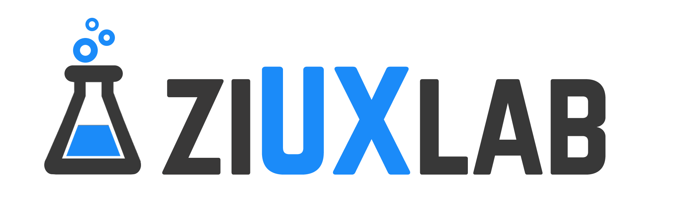

## WebSite

<table>
<tr>
<td>
  Página incial de ziuxlab.com, para el desarrollo de software, aplicacion moviles y webapps con diseños centrados en el usuario UI/UX,
  pruebas de usabilidad con eyetracker.
   Puedes ver la pagina oficil en   https://ziuxlab.com
</td>
</tr>
</table>

